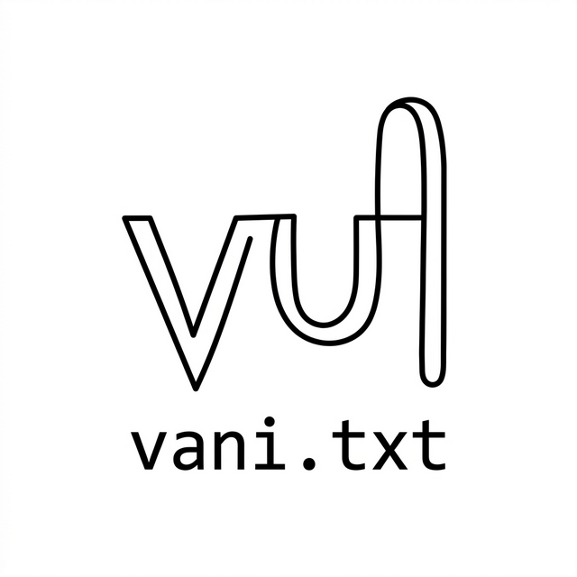
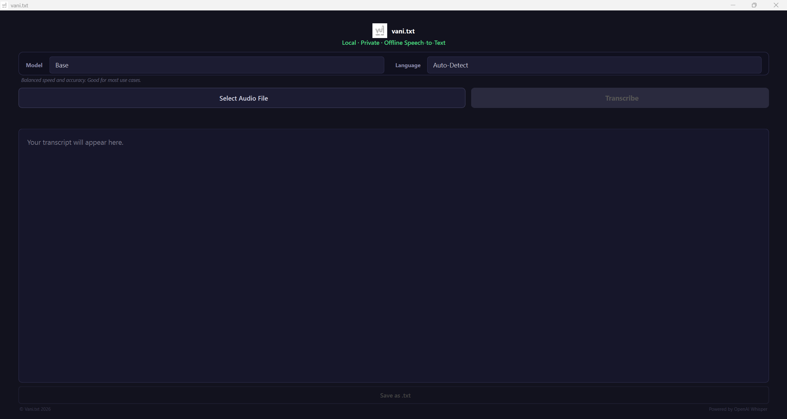

<div align="center">
  
  <h1>vani.txt</h1>
  <p><b>100% Local · Private · Offline Speech-to-Text</b></p>
</div>

**vani.txt** is a standalone, completely offline Windows desktop application that transcribes audio files to text using OpenAI's powerful Whisper models locally on your machine. It is designed to be completely private, meaning your audio files never leave your computer, and is accessible to anyone without requiring Python, command-line knowledge, or complex configurations.



## ✨ Features
- **Plug and Play:** Download a single `.exe` file and double-click to run. No dependencies needed!
- **100% Private & Offline:** Everything runs locally on your machine.
- **Multilingual Support:** Auto-detects languages and provides highly accurate transcription for global languages (with excellent support for Hindi, Tamil, Telugu, Kannada, Malayalam, Marathi, Gujarati, Urdu, and Bengali).
- **Hardware Accelerated:** Automatically detects if you have an NVIDIA GPU and utilizes it for lightning-fast transcription, or gracefully falls back to CPU.
- **Real-time Streaming:** Watch your transcript generate live, line by line.

---

## 🚀 Installation 

Since **vani.txt** bundles all requirements (including Python, PyTorch, FFmpeg, and the Whisper library), the download file is deliberately large (~2GB) but guarantees it works right out of the box.

1. Go to the [Releases page](../../releases/latest).
2. Download the latest `vani-txt-windows-v1.0.exe` file under the "Assets" section.
3. Once downloaded, simply double-click the `.exe` file to launch the application. *(Note: Microsoft Defender may show a "Windows protected your PC" screen on the first run since the app is newly published. Click "More info" > "Run anyway".)*

---

## 📖 How to Use

1. **Launch the App:** Open `vani.txt`.
2. **Configure Settings:**
   - **Model:** Select `Base` for quick/decent results, or `Small`/`Medium` if transcribing Indian languages for much better accuracy.
   - **Language:** Leave as `Auto-Detect`, or specifically select the language spoken in your audio file to improve processing speed.
3. **Select Audio:** Click **"Select Audio File"** and choose your `.mp3`, `.wav`, `.m4a`, or video file.
4. **Transcribe:** Click **"Transcribe"**. A progress bar will appear, and you will see the text streaming live into the editor.
5. **Edit & Save:** Once finished, you can manually fix any typos right inside the text editor screen, then click **"Save as .txt"** to export your final transcript!

---

## 🤝 Support the Developer

**vani.txt** is completely free, open-source, and has no hidden subscriptions. If this tool saved you hours of manual typing or helped your workflow, please consider supporting its ongoing development!

If you are in **India**:
- **UPI:** [Click here to scan my UPI QR Code](upi_qr.jpg)

If you are **International**:
- **Ko-Fi:** [https://ko-fi.com/siddhantrathi](https://ko-fi.com/siddhantrathi)

---

## 🛠️ Contributing

Contributions to vani.txt are welcome. Please ensure that any proposed changes adhere to the project's coding standards and our objective of maintaining an accessible, private offline application. Note: For any pull requests utilizing AI-generated code, a human-in-the-loop review is mandatory to ensure code quality and security.

### 1. Local Development Setup
To build and run the app from source:
```bash
# Clone the repository
git clone https://github.com/yourusername/vani.txt.git
cd vani.txt

# Create a virtual environment
python -m venv .venv
.\.venv\Scripts\activate

# Install requirements
pip install -r requirements.txt

# Run the app locally
python WhisperGUIApp\app.py
```

### 2. Building the Executable
We use PyInstaller to package the app. Once you have made your changes:
```bash
pip install pyinstaller
pyinstaller build_app.spec
```
The final binary will be generated in the `dist` folder.

### 3. Guidelines
- **Code Style:** Follow PEP-8 standards. Keep GUI logic in `app.py` clean and separated from the background thread process.
- **UI/UX:** We prioritize a minimalistic, simple, "grandma-friendly" interface. Do not add complex developer toggles to the main UI without discussion.
- **Pull Requests:** Open an issue first to discuss major architectural changes before submitting a PR.
